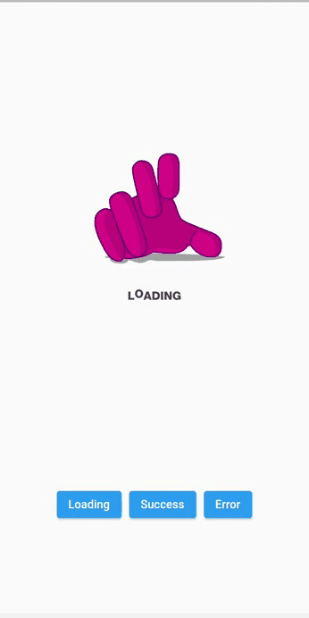

# 🔥🔥 LottieFiles Animation App 

 
Repo for The Article "How to Add cool LottieFiles After Effect Animations to You Flutter App" 
 
 

## ✨ Libraries used

* [Lottie](https://pub.dev/packages/lottie)
 

Star⭐ the repo if this has helped you in any way.
 

## 📸 Demo
 
 

 

## 🤓 Author

## Getting Started

This project is a starting point for a Flutter application.

A few resources to get you started if this is your first Flutter project:

- [Lab: Write your first Flutter app](https://flutter.io/docs/get-started/codelab)
- [Cookbook: Useful Flutter samples](https://flutter.io/docs/cookbook)

For help getting started with Flutter, view our 
[online documentation](https://flutter.io/docs), which offers tutorials, 
samples, guidance on mobile development, and a full API reference.
